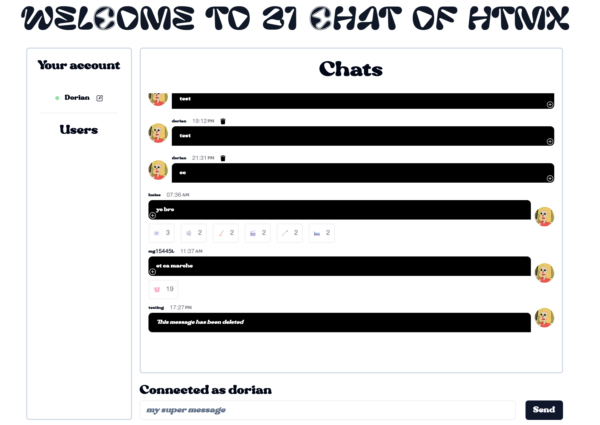

<div id="top"></div>


<!-- PROJECT LOGO -->
<br />
<div align="center">
    

<h3 align="center">21 chat of htmx</h3>

  <p align="center">Web server using fiber, and learn about htmx, deploy to heroku cloud.</p>

  

</div>

 <br />  

<!-- TABLE OF CONTENTS -->
<details>
  <summary>Table of Contents</summary>
  <ol>
    <li>
      <a href="#about-the-project">🧭 About The Project</a>
      <ul>
        <li><a href="#built-with">🏗️ Built With</a></li>
      </ul>
    </li>
    <li>
      <a href="#getting-started">📋 Getting Started</a>
      <ul>
        <li><a href="#prerequisites">🗺️ Prerequisites</a></li>
        <li><a href="#installation">⚙️ Installation</a></li>
      </ul>
    </li>
    <li><a href="#usage">💾 Usage</a></li>
    <li><a href="#contributing">🔗 Contributing</a></li>
    <li><a href="#license">📰 License</a></li>
    <li><a href="#contact">📫 Contact</a></li>
    <li><a href="#acknowledgments">⛱️ Acknowledgments</a></li>
  </ol>
</details>

<br>


<!-- ABOUT THE PROJECT -->
## 🧭 About The Project

### 🏗️ Built With

List of technologies / frameworks used during the project.

* [](https://dashboard.heroku.com/)
* [](https://go.dev/)
* [](https://tailwindcss.com/)
* 🐋 Docker
* Vue
* Shadcn

<p align="right"><a href="#top">⬆️</a></p>


<!-- GETTING STARTED -->
## 📋 Getting Started

The main concept of this project is to create a web server using fiber, and learn about htmx, deploy to heroku cloud.

### 🗺️ Prerequisites

You need node 18 and Go 1.21 for running this project.

Get Nodejs at this url : https://nodejs.org/en/download/

Get Golang at this url : https://go.dev/doc/install

Also you need to create **.env** at the root folder project :

```bash
JWT_SECRET=value
PORT=80
URL_MONGODB=value

```

<p align="right"><a href="#top">⬆️</a></p>


<!-- USAGE EXAMPLES -->
## 💾 Usage

Run the backend :

You can run the whole application using air :

```bash
$bash : air -c .air.toml
```

<p align="right"><a href="#top">⬆️</a></p>


<!-- CONTRIBUTING -->
## 🔗 Contributing

Contributions are what make the open source community such an amazing place to learn, inspire, and create. Any contributions you make are **greatly appreciated**.

If you have a suggestion that would make this better, please fork the repo and create a pull request. You can also simply open an issue with the tag "enhancement".
Don't forget to give the project a star! Thanks again!

1. Fork the Project
2. Create your Feature Branch (`git checkout -b feature/AmazingFeature`)
3. Commit your Changes (`git commit -m 'Add some AmazingFeature'`)
4. Push to the Branch (`git push origin feature/AmazingFeature`)
5. Open a Pull Request

<p align="right"><a href="#top">⬆️</a></p>


<!-- LICENSE -->
## 📰 License

Distributed under the MIT License. See `LICENSE.txt` for more information.

<p align="right"><a href="#top">⬆️</a></p>


<!-- CONTACT -->
## 📫 Contact

Reach me at : gauron.dorian.pro@gmail.com.

Project Link: [https://github.com/Michelprogram/chat-app-htmx.git](https://github.com/Michelprogram/chat-app-htmx.git)

<p align="right"><a href="#top">⬆️</a></p>


<!-- ACKNOWLEDGMENTS -->
## ⛱️ Acknowledgments

This space is a list to resources i found helpful and would like to give credit to.

* Htmx https://htmx.org/
* Mongo go https://www.mongodb.com/docs/drivers/go/current/
* Dependency injection https://dev.to/dsysd_dev/dependency-injection-like-a-pro-in-golang-43ao
* Heroku https://www.heroku.com/
* Fiber https://gofiber.io/
* Tailwind https://tailwindcss.com/

<p align="right"><a href="#top">⬆️</a></p>

<a href="https://github.com/othneildrew/Best-README-Template">Template inspired by othneildrew</a>
